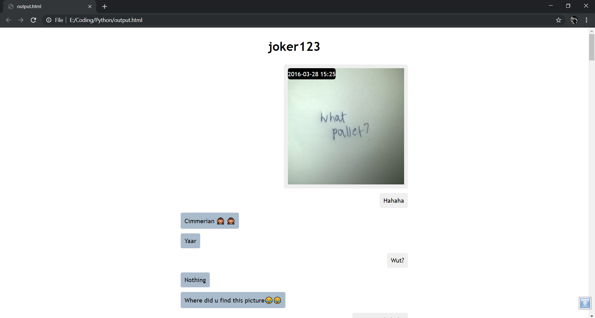

# How to use

- Place messages.json from instagram backup in the same folder. 
- Run the python file and provide instagramusername at prompt.
- A output.html file will be generated which will be in a nice readable format. Hover over messages to see time at which the message was sent.

## Output

